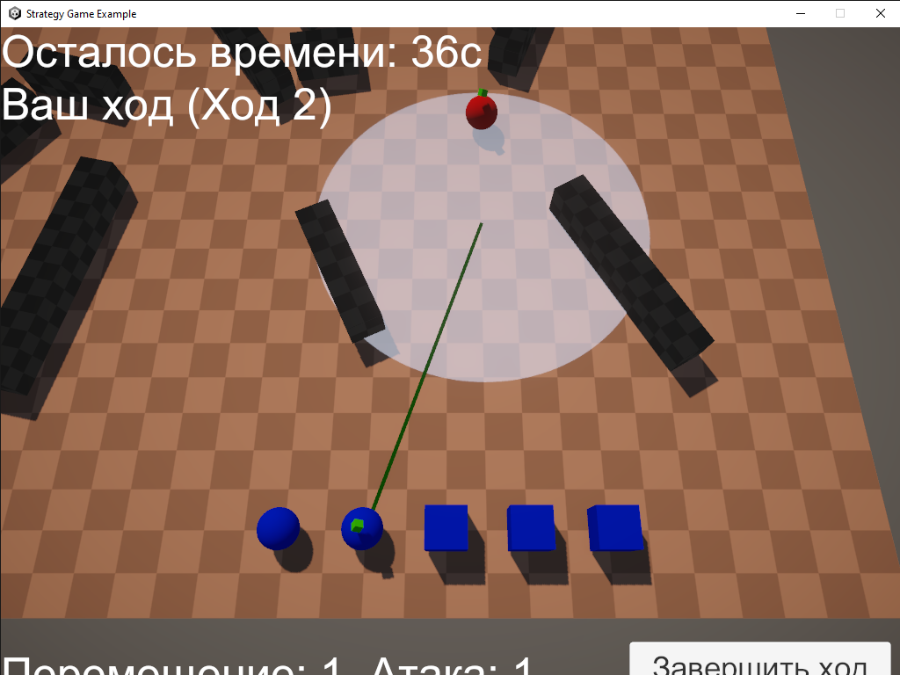

# Strategy Game Example

Разработано на Unity 2022 LTS с использованием Netcode for GameObjects.

Реализация сетевой пошаговой стратегии для двух игроков. Игра сосредоточена на тактическом перемещении и атаке юнитов на процедурно сгенерированном поле боя с ограничениями по действиям и времени.



## Запуск

1. Клонируйте репозиторий:
```bash
git clone  https://github.com/exstarzii/strategy-game-example.git
```
2. Откройте проект через Unity Hub (версия 2022.3 LTS).

3. Запустите одну копию как Host, вторую как Client (например, одна в редакторе, другая в билде. Приложение автоматически станет хостом, если его нет. А так же автоматически подключится как клиент, если хост уже запущен ).

## Управление

- **Левая кнопка мыши (ЛКМ):** выбрать юнита  
- **Правая кнопка мыши (ПКМ):** построить путь до точки  
- **Двойной ПКМ:** отправить выбранного юнита в указанную точку  
- **ПКМ по вражескому юниту:** приказ на атаку 

## Основные особенности

- Пошаговый PvP-мультиплеер 1 на 1
- Игровое поле с процедурной генерацией препятствий
- Юниты двух типов: быстрые ближнего боя и медленные дальнего боя
- Ограничение на 2 действия в ход: перемещение и атака
- Отображение радиуса атаки и валидных целей
- Построение пути с учетом препятствий и других юнитов
- 60 секунд на ход и система ничьей
- Интерфейс с отображением хода, таймера и доступных действий

## Правила игры

- Каждый игрок управляет зеркальным набором юнитов.
- В свой ход игрок может выполнить одно перемещение и одну атаку (в любом порядке), либо завершить ход досрочно.
- Двойное перемещение или двойная атака в один ход невозможны.
- Ход завершается автоматически по истечении 60 секунд.

## Типы юнитов

| Тип                    | Скорость | Радиус атаки  |
|------------------------|----------|---------------|
| Быстрый ближнего боя   | Высокая  | Маленький     |
| Медленный дальнего боя | Низкая   | Большой       |

## Генерация карты

- Размер карты и зона генерации задаются параметрами.
- Препятствия размещаются случайным образом с возможностью настройки:
  - Типа препятствия
  - Минимального и максимального количества
- Зоны появления юнитов задаются отдельно для каждой команды.

## Валидация и логика

- Сервер проверяет корректность всех действий игроков.
- Недопустимые перемещения и атаки блокируются.

## Интерфейс

Интерфейс отображает:
- Номер текущего хода
- Чей сейчас ход
- Таймер
- Возможность совершения перемещения и атаки

## Технические детали

- Движок: Unity 2022.3 LTS
- Графика: URP
- Сетевое взаимодействие: Netcode for GameObjects
- Игра начинается автоматически при подключении второго игрока

## Дополнительно

- Все атаки фатальны: здоровье и урон равны единице.
- Если на 15-м ходу или позже у одного из игроков больше юнитов — он выигрывает.